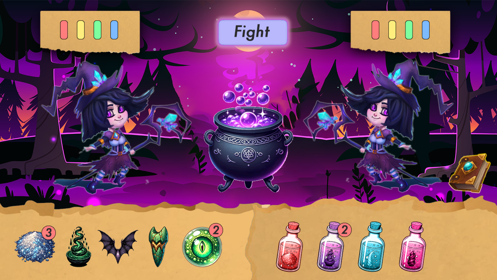

# Project Cauldron
## 🎃🎃🎃 Phantom Forge: A Halloween Hackathon 🎃🎃🎃

## Overview
Witches Brew is a one player game against the computer. The player commences with a health level and levels of strength, agility and dexterity. As the game proceeds the player must fight off enemies that also have strength, agility and dexterity levels. Against any given enemy the player will lose health points as a fight proceeds if the player's strength, agility and dexterity combined are less than that of the opponent. If the player's health points reach zero the game is over! However the player also has access to ingredients for making potions. Different potions will affect the strength, agility and dexterity of the player or of the enemy thus affecting the players ability to win. Brew the right potions to stay alive, stay in the game and continue to beat your enemies!!

Live demo: https://Erikas-Ramanauskas.github.io/Project-Cauldron

## Table of contents
- [Project Cauldron](#project-cauldron)
   * [🎃🎃🎃 Phantom Forge: A Halloween Hackathon 🎃🎃🎃](#-phantom-forge-a-halloween-hackathon-)
   * [Overview](#overview)
   * [Table of contents](#table-of-contents)
   * [How to Play](#how-to-play)
   * [Agile Methodology](#agile-methodology)
      + [Project Goals](#project-goals)
      + [Target Audience](#target-audience)
      + [User Stories](#user-stories)
         - [First time user](#first-time-user)
         - [Game player](#game-player)
      + [Development process](#development-process)
   * [UX Design](#ux-design)
   * [UI Design](#ui-design)
      + [Components](#components)
      + [Fonts](#fonts)
      + [Colours](#colours)
      + [Sounds](#sounds)
      + [Images and Animations](#images-and-animations)
      + [Wireframes](#wireframes)
   * [Features](#features)
      + [Home Page](#home-page)
      + [Game Menu](#game-menu)
      + [Game Page](#game-page)
      + [Witches Kitchen](#witches-kitchen)
      + [Rules Page](#rules-page)
      + [Creators Page](#creators-page)
   * [Technologies Used](#technologies-used)
   * [Testing](#testing)
   * [Deployment](#deployment)
   * [Credits](#credits)
   * [Acknowledgements](#acknowledgements)
   * [Team](#team)

## How to Play
- At the outset the player is assigned health points as well as levels for strength, agility and dexterity.
- In each round the player will face an enemy with its own strength, agility and dexterity levels
- To defeat an enemy the player must fight the enemy using the Fight button.
- Each time the fight button is clicked the totals for strength, agility and dexterity for both player and enemy at that given time are assessed. If the enemy is stronger the player loses a health point. Each time prior to clicking the fight button the player can brew potions that can affect player or enemy levels. This is key to the game strategy and is explained further below.
- The player must keep fighting until the enemy is defeated or the the player runs out of health points.
- If the player health points go to zero the game ends.
- If you defeat an enemy you proceed to the next round and the health points are reset.
- The player also has access to ingredients in the Witches Kitchen. These ingredients can be used to make potions. The potions can then be used to increase your levels or decrease those of your enemy as per the properties of the particular potion. The recipes for and properties of all potions are found in the recipe book.
- At any point in the game a player can enter the Witches Kitchen and brew potions. The player can brew a maximum of ten potions against any one enemy.
- Create your potions wisely. Win as many fights as you can. Stay alive!

## Agile Methodology
### Project Goals
- Provide the user with a fun to play Halloween themed game.
- The game can be played in a standard web browser.
- The game combines elements of strategy with luck.
- The game contains elements that users can choose to explore.

### Target Audience
- The game is aimed at people of all ages with an interest in gaming.
- In particular the game is aimed towards those with an interest in fiction and fantasy with its inclusion of witches, potions and otherworldly enemies.
- The game is aimed at those who like elements of strategy as well as luck to progress through the game rounds. It is not about speed of execution.

### User Stories
#### First time user
- As a first-time user, I want to see the home page so that I can quickly understand the purpose of the site
- As a first-time user, I want to see the game rules so that I can understand how to play the game
- As a first-time user, I want to see the game menu so that I can easily navigate the site
- As a first-time user, I want to see the game credits so that I can know who made the game
- As a first-time user, I want to see the kitchen so that I can try to make potions

#### Game player
- As a player, I want to see the game board so that I can play the game
- As a player I want to see cauldron animations while playing a game so that I can feel the halloween spirit
- As a player, I want to see the recipes of the potions so that I can know what to make
- As a player, I want to see the ingredients so that I can know what I need to collect
- As a player, I want to see the ingredients I added to the cauldron so that I can know what I need to add more to make a potion
- As a player, I want to see my stats so I know what potions I need to prepare
- As a player, I want to see my enemies so I know what I need to fight
- As a player, I want to see the enemy stats so I know what I need to fight
- As a player, I want to be able to drag and drop ingredients into the cauldron so that I can make potions
- As a player, I want to see the potion I made, so that I can know how it looks like
- As a player, I want to fight enemies so that I can earn points
- As a player, I want to see my main score(HP) so that I can know how long I can play before I lose/win
- As a player, I want to see game over screen so that I can know when I lose
- As a player, I want to see the game feedback when I win a fight
- As a player, I want to see the game feedback when I lose a fight
- As a player, I want to know that I won the whole game so that I can feel a sense of accomplishment
- As a player, I want to get all interaction feedback in a form of sound so that I can feel more immersed in the game

### Development process
This project was developed with the Agile methodology which allowed us to develop the app iteratively and incrementally, and adapt changes with flexibility even in the late stages of development.

*GitHub Issues* and *Projects* are used to manage the development process.

The Project link: https://github.com/users/Erikas-Ramanauskas/projects/3

The GitHub _Kanban Board_ is used to manage the process and track the progress of the development. When User Story is created, it is automatically added to the Backlog column to be prioritized. The product Backlog is never complete, as it is a dynamic document to respond to changes effectively. As new features are identified, they are added to the product Backlog. As the product is released, the product Backlog is constantly updated to reflect changes in the product and changes in the market. The Kanban board includes the following columns:

- **Product Backlog** - the list of all _User Stories that have not yet been scheduled to be completed. As new User Stories are created, they are automatically added to the Backlog column.
- **Sprint Backlog** - the collection of prioritized User Stories that have been selected for the current Sprint.
- **In Progress** - the user stories that are currently being developed.
- **Done** all completed and tested User Stories.

*Kanban Board*

The *Project Table* is used to filter and prioritize *User Stories*.
At the start of each sprint, the _User Stories_ are selected from the _Product Backlog_ and added to the _Sprint Backlog_ with attached priority labels. The *User Stories* prioritized using the MoSCoW method. The prioritization was based on the following criteria:

- **Must Have** - The *User Story* is crucial and add significant value to the product and must be delivered in the current iteration.
- **Should Have** - The User Story is important but not critical to the success. Simply delivery is not guaranteed within the current iteration.
- **Could Have** - The *User Story* is desirable and would only be delivered in their entirety in a best-case scenario. When a problem occurs and the deadline is at risk, one or more could-have items are dropped.
- **Won't Have** - The *User Story* will not be delivered in the current delivery timebox but may be considered for the future. The prioritization is based on the 60-20-20 rule where 60% of the effort is spent on the *Must Have*, 20% on the *Should Have* and the rest 20% on the *Could Have*.

*Project Table*

## UX Design
All aspects of the UX design flow directly from the fact that the goal is the creation of a browser based game. From the moment the user navigates to the website the user should feel that they are now playing a game. Therefore the landing page does not have a navigation bar and footer typical of most information provision type sites. Instead it has a button based “game menu”. The menu is positioned front and centre and the user options are simple and clear. The second element is the inclusion of a colourful background in keeping with the theme of the site. This colourful theme simple navigation is repeated throughout. The pages containing the game rules and creator information continue this approach. The game itself is contained across 2 pages. These continue the overall design approach but contain increased imagery and colour. The aim is to clearly let the user know that they are now in the game proper and also to achieve the goal of providing elements to explore.

## UI Design
### Components
...

### Fonts
The font used is "Shadows Into Light" from Google Fonts and was chosen to reflect the spooky, Halloween, witches theme while maintaining readability. Other somewhat more stylised and potentially suitable fonts were also trialled but it was considered that readability was compromised.

### Colours
Much of the colour on the site is generated using a careful choice of background images. These images have been chosen to provide consistency across the site and consist largely of blacks, purples, reds, oranges and browns that were considered to have an autumnal/Halloween feel.
Where colours are applied to fonts and backgrounds these have been chosen to remain consistent with the chosen images and the overall theme.
In particular:
- The Witches Brew title is in white (#ffffff) to provide contrast with the colourful background.
- #eca72c, an orange colour has been used for card and button backgrounds.
- #f0c478, a lighter orange colour has been used for hover over buttons.
- #504069, a purple colour has been used for some text including the creator’s cards.
- #212529, a black colour has been used for some text including button texts.

### Sounds
Short sounds such as a witches cackle have been used to add to the game atmosphere. These were sourced from <a href="https://freesound.org/">Freesound</a>.

### Images and Animations
Images have been used to provide much of the colour for the site as outlined above. They are also used to create specific components of the game play. ChatGPT has been used to create some images and others have been sourced from freepik.com and attributed in the credits below.

### Wireframes

Home Page

Game Page

Kitchen Page

Recipe Book

Creators Page

Rules Page

## Features
### Home Page
- Designed to look like a game menu rather than a website home page.
- Contains a colourful background image in keeping with the theme of the game.
- A simple game menu is located front and centre.

### Game Menu
- This is the key feature on the home page.
- Contains 4 buttons that are links leading to the Game Page, the Witches Kitchen, the Creators Page and the Rules Page
### Game Page
- Displays all the information the Player needs to play the fight aspect of the game.
- Player area displays information on the players current, health, strength, agility and dexterity.
- Enemy area displays information on the strength, agility and dexterity of the next opponent the player faces.
- Potions Area displays the brewed potions the player currently has available together with their properties and allows the player choose potions to use in the current round.
- Kitchen button allows the player to visit the Witches Kitchen at any point to brew potions.
- Clicking the Fight button allows the player to fight the enemy and complete the round once they are ready.

### Witches Kitchen
- Recipe Book image when clicked on opens the book and allows the player to view potions that can be brewed from the various ingredients.
- The ingredients area shows currently available ingredients.
- Drag and Drop allows available ingredients to be dragged and dropped into the Cauldron.
- Dropping ingredients into the cauldron “mixes” them and dropping in ingredients in a combination from the book will create the specified potion.
- The potions area displays created potions and these are then available in the Game Page also as described above.

### Rules Page
- Contains a text area outlining the rules of the game.
- Buttons allow navigation to other pages. This simple navigation approach is consistent with the game style applied throughout.

### Creators Page
- Contains a simple card for each of the members of the team behind the project.
- The cards are also links to each of the team members chosen personal website allowing users and players to find out more about the team.
- Each of the creators have been assigned humorous titles in line with the overall fantasy/Halloween theme.

## Technologies Used
- HTML
- CSS
- Javascript
- Figma (For Wireframes)
- Bootstrap (for styling and grid)
- Font Awesome (for icons)
- Favicon (for favicon generation)
- Github Pages (for deployment)

## Testing
| # | Feature | Expected Outcome | Testing Performed | Pass/Fail |
| :---: | :--- | :---: | :---: | :---: |
| | Navigation | | | |
| --- | --- | --- | --- | --- |
| 1 | Home page - game | redirect to game | press button | ✅ |
| 2 | Home page - kitchen | redirect to kitchen | press button | ✅ |
| 3 | Home page - creators | redirect to creators page | press button | ✅ |
| 4 | Home page - game rules | redirect to game rules page | press button | ✅ |
| 5 | game rules - home page | redirect to home page | press button | ✅ |
| -- | --- | --- | --- | --- |
| | Game Engine | | | |
| --- | --- | --- | --- | --- |
| 6 | Drag potion to character | Stats changed + potion amount - 1 | drag potion | ✅ |
| 7 | Reduce potion amount | Amount badge - 1 | drag potion | ✅ |
| 8 | Increase / Decrease player stats | Player stats + potion stats | drag potion + attack | ✅ |
| 9 | Increase / Decrease enemy stats | Enemy stats + potion stats | drag potion + attack | ✅ |
| 10 | Game win | User feedback + new game | attack | ✅ |
| 11 | Game lose | User feedback | attack | ✅ |
| -- | --- | --- | --- | --- |
| | Recipe Book | | | |
| --- | --- | --- | --- | --- |
| 12 | Open | Show recipe book | press icon | ✅ |
| 13 | Close | Close recipe book | press icon | ✅ |
| 14 | Next page | Show next potion stats + recipe | press icon | ✅ |
| 15 | Previous page | Show previous potion stats + recipe | press icon | ✅ |
| -- | --- | --- | --- | --- |
| | Creators Page | | | |
| --- | --- | --- | --- | --- |
| 16 | Links to creator github / linkedin | Open page in new tab | press cards | ✅ |

## Deployment
This site has been deployed from a GitHub repository using GitHub technology to GitHub Pages. The site can be accessed <a href="https://erikas-ramanauskas.github.io/Project-Cauldron/" target="_blank">here</a>.

## Credits
- ChatGPT was used to generate some of the images used in this project.
- Project and Readme templates were provided by Code Institute.
- "Shadows Into Light" font is taken from Google Fonts.
- Image for recipe book:
<a href="https://www.freepik.com/free-vector/old-mystic-books-magic-spells_32591266.htm#query=book%20game%20art&position=1&from_view=search&track=ais">Image by upklyak</a> on Freepik
- Image for open recipe book:
<a href="https://www.freepik.com/free-vector/blank-open-book_4228214.htm#page=3&query=game%20art%20open%20book&position=31&from_view=search&track=ais">Image by brgfx</a> on Freepik
- Image for background image:
<a href="https://www.freepik.com/free-vector/dark-forest-with-witch-cauldron-trees-silhouettes-purple-light-moon-night-halloween-background-with-gold-cooking-boiler-with-magic-potion-vector-cartoon-illustration-with-cauldron-wood_21329622.htm#query=halloween%20game%20background&position=0&from_view=search&track=ais">Image by upklyak</a> on Freepik
- Image for witches kitchen background
<a href="https://www.freepik.com/free-vector/alchemical-laboratory-with-magic-books-potions_37205185.htm#query=kitchen%20halloween%20game%20background&position=5&from_view=search&track=ais">Image by upklyak</a> on Freepik
- Image for ripped paper images:
<a href="https://www.freepik.com/free-vector/set-ripped-paper-cardboard-pieces-black_37340853.htm#query=ripped%20paper%20game%20art&position=48&from_view=search&track=ais">Image by upklyak</a> on Freepik
- Sounds sourced from <a href="https://freesound.org/">Freesound</a>.

## Acknowledgements
- Code Institute and the Hackathon team for running the Code Institute October 2023 Hackathon
- Hackathon Facilitator Joy Zadan for guidance and encouragement.

## Team
- Pavlo Myskov
    - [GitHub](https://github.com/FlashDrag)
    - [LinkedIn](https://www.linkedin.com/in/pavlo-myskov)
- Erikas Ramanauskas
    - [GitHub](https://github.com/Erikas-Ramanauskas)
    - [LinkedIn](https://www.linkedin.com/in/erikas-ramanauskas)
- Linus Elvius
    - [GitHub](https://github.com/linx02)
    - [LinkedIn](https://www.linkedin.com/in/linus-elvius-52b098266)
- Mark Fenton
    - [GitHub](https://github.com/fenton1000)
    - [LinkedIn](https://www.linkedin.com/in/mark-fenton)
- Pablo Embarach
    - [GitHub](https://github.com/PEmbarach)
    - [LinkedIn](https://www.linkedin.com/in/pablo-embarach-boeira)